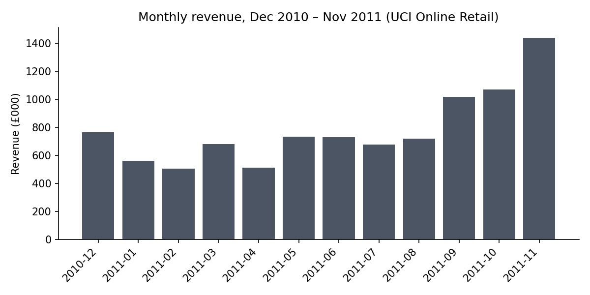
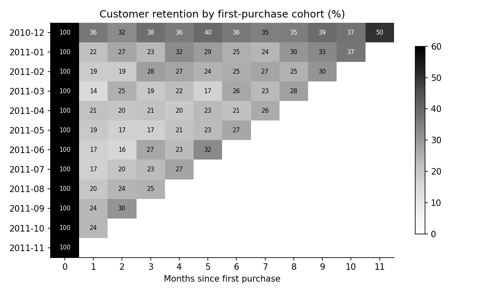
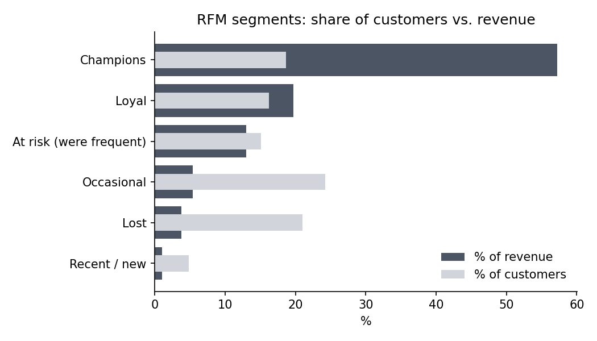

# Project 1: Retail Customer Analytics with SQL (real data)

Revenue trends, cohort retention, and RFM customer segmentation for a real UK online retailer, using **SQL (window functions, CTEs)** in SQLite and Python.

**Data:** UCI *Online Retail* dataset, 541,909 real transaction lines (Dec 2010 – Dec 2011). Not simulated. Source and citation are in [`common/retail.py`](../common/retail.py).
> Chen, D., Sain, S.L., & Guo, K. (2012). Data mining for the online retail industry: A case study of RFM model-based customer segmentation using data mining. *Journal of Database Marketing & Customer Strategy Management*, 19(3), 197-208. doi:10.1057/dbm.2012.17

After cleaning (see Project 2), **519,429 sale lines, 19,636 invoices, £9.85M revenue, 38 countries**. Cancelled orders are netted out. December 2011 is partial, so monthly trends stop at November.

## SQL techniques used
CTEs, `JOIN ... USING`, `COUNT(DISTINCT)`, window functions (`NTILE`), date arithmetic (`julianday`), subqueries, and cohort logic. All queries are in [`queries.sql`](queries.sql). Results are in [`findings.md`](findings.md).

## What I found
- **Seasonality is strong.** November 2011 revenue (£1.44M) was **2.5x** the Jan–Mar 2011 monthly average.
- **The UK is 84.8% of revenue.** The next largest market is the Netherlands (2.9%).
- **Customers are concentrated.** The top **27%** of identified customers generate 80% of identified-customer revenue.
- **Only about 1 in 5 new customers buys again the next month** (21.3% on average in month 1). Averages at longer horizons look higher (26.8% at month 6), but that is misleading: only the earliest cohorts can be observed that far out, and the December 2010 cohort (882 customers) includes existing customers, since the data window starts then. Compare cohorts row by row, not averages.
- **RFM segments:** "Champions" (recent, frequent, high-spending) are **19% of customers but 57% of revenue**. A further 15% are "At risk (were frequent)", customers who used to buy often and have gone quiet, which makes them a natural win-back target.





## Recommendations (what I'd tell the business)
1. **Plan inventory and staffing for Q4.** Demand more than doubles from the Q1 baseline.
2. **Run a win-back campaign for "At risk (were frequent)" customers**, the 15% of customers with past purchasing history who have stopped.
3. **Protect Champions** with early access or account support, since losing a few would hurt revenue disproportionately.
4. **Test a first-month follow-up offer.** Only about 1 in 5 new customers buys again the next month, so there is room to lift repeat rate.

## Limitations
- Customer-level results exclude the **~25% of lines with no CustomerID** (see Project 2), so they describe identified customers only.
- Many customers are wholesalers, so "customer" behavior differs from consumer retail.
- One year of data cannot separate seasonality from growth, and the first cohort is left-censored (it includes customers who were already buying before Dec 2010).
- RFM thresholds (quartiles and the segment rules) are my choices, not standards.

## Run it (optional, results are already saved)
```bash
pip install -r ../requirements.txt
python analysis.py     # downloads the data on first run (needs internet), then runs the SQL and builds charts
```
