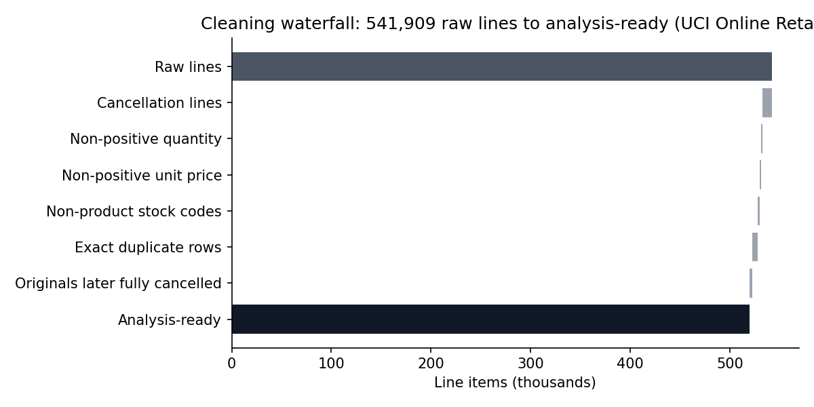
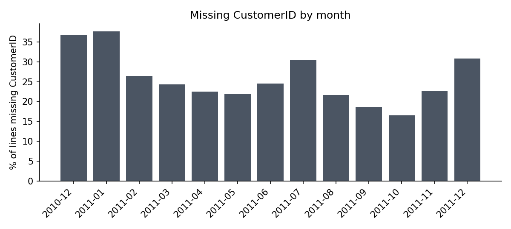

# Project 2: Data Quality Audit of Real Retail Transactions

A systematic audit of a real, messy dataset: find the issues, quantify their impact, show where they concentrate, and build a **documented cleaning pipeline** where every removed row is counted.

**Data:** UCI *Online Retail* dataset, 541,909 real transaction lines from a UK online retailer. Not simulated.
> Chen, D., Sain, S.L., & Guo, K. (2012). Data mining for the online retail industry: A case study of RFM model-based customer segmentation using data mining. *Journal of Database Marketing & Customer Strategy Management*, 19(3), 197-208. doi:10.1057/dbm.2012.17

**Skills shown:** data profiling, validation rules, root-cause analysis, impact quantification, reproducible cleaning, communicating data caveats.

## Issue inventory (real counts)
| Issue | Lines | % of lines |
|---|---:|---:|
| Missing CustomerID | 135,080 | 24.93% |
| Exact duplicate rows | 5,268 | 0.97% |
| Non-product stock codes (postage, fees, manual entries) | 2,995 | 0.55% |
| Non-positive unit price | 2,517 | 0.46% |
| Missing description | 1,454 | 0.27% |
| Cancellation lines | 9,288 | 1.71% |
| Non-positive quantity, not a cancellation | 1,336 | 0.25% |

Full table with notes: [`output/audit_report.md`](output/audit_report.md).

## Cleaning waterfall


**519,429 of 541,909 lines (95.9%) are analysis-ready.** About **7.7% of the apparent positive revenue** (£10.67M raw vs. £9.85M clean) was not real merchandise sales: fees and postage, duplicates, and orders that were later cancelled.

## The most interesting finding: two huge orders that never happened
Two enormous orders, **80,995 units** of one paper-craft product and **74,215 units** of a ceramic jar, were **cancelled within about 15 minutes** (same customer, same product, same quantity). In the raw data they look like the #2 and #6 best-selling products. After matching cancellations to the original orders, they disappear. Anyone analyzing the raw file without catching this would report the wrong best-sellers and inflated revenue.

## Where the missing CustomerIDs are
- **27.0% of UK lines** lack a CustomerID, vs. 8.7% for Ireland and under 1% for France and Belgium.
- Lines without an ID are smaller on average (**£11.49** vs. **£21.49** per line) but still represent **15.3% of analysis-ready revenue**.
- **Implication:** customer-level analytics (retention, RFM) quietly leave out about a sixth of revenue. That should be stated on every customer dashboard built from this data, or fixed at the source (require an ID, or capture guest checkout).



## Judgment calls (and why they matter)
- **Exact duplicates were removed.** Some may be genuine repeated entries (the same item scanned twice). I treated them as duplicates because they are identical on all 8 fields, but this is an assumption.
- **Cancellation matching is exact-only** (same customer, product, and quantity). Partial returns are not netted, so some returned revenue remains.
- **Non-product codes** (POST, DOT, M, etc.) were excluded from merchandise sales but are real money and should be analyzed separately for shipping and fee revenue.

## Reproducibility
Every number comes from `audit.py`, and the shared cleaning rules are in [`common/retail.py`](../common/retail.py).
```bash
pip install -r ../requirements.txt
python audit.py
```
