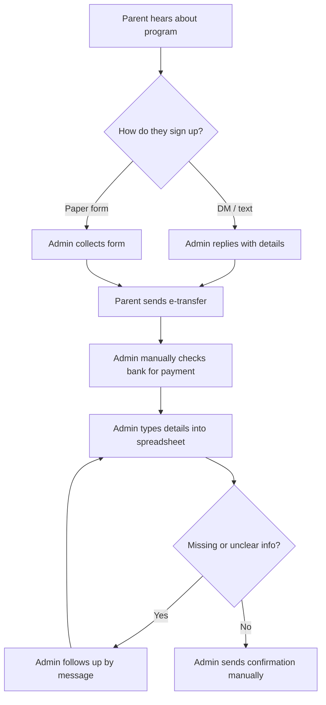
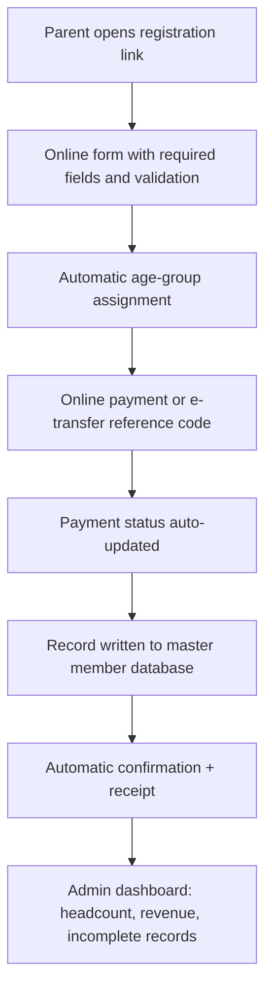

# Project 3: Registration Process Improvement (Business Analysis Case Study)

A business analysis deliverable package for improving how a youth sports association registers members and handles payment. It is written as a **case study modeled on the workflow of a volunteer-run youth basketball association**. Any metrics shown as targets are **assumptions to validate**, not measured results.

**Skills shown:** requirements elicitation, as-is / to-be process mapping, MoSCoW prioritization, user stories with acceptance criteria, KPI design, RACI, risk analysis.

---

## 1. Problem statement
Registration is collected through a mix of direct messages, paper forms, and e-transfers. Staff re-key the information into a spreadsheet. This creates duplicate entries, missing data (e.g., guardian contact, emergency contact), unclear payment status, and a heavy admin load on volunteers right before the season starts.

## 2. Scope
**In scope:** registration intake, payment confirmation, member database updates, confirmation messaging.
**Out of scope:** scheduling, league standings, coaching assignments.

## 3. Stakeholders
| Stakeholder | Interest |
|---|---|
| Parents / guardians | Fast, simple sign-up; clear confirmation and receipt |
| Players | Placed in the right age group |
| Volunteers / admins | Less manual entry; fewer follow-ups |
| President / operator | Accurate headcount and revenue; reduced event-day issues |

## 4. As-is process

**Pain points:** (1) double handling of data, (2) manual payment matching, (3) no validation at entry, (4) follow-up loops, (5) no single source of truth.

## 5. To-be process

## 6. Requirements (MoSCoW)
| ID | Requirement | Priority |
|---|---|---|
| FR-1 | Single online registration form with required-field validation | Must |
| FR-2 | Age group assigned automatically from date of birth | Must |
| FR-3 | Payment status tracked per member (paid / pending / failed) | Must |
| FR-4 | Automatic confirmation message with receipt | Must |
| FR-5 | Admin view of headcount by age group and incomplete records | Should |
| FR-6 | Duplicate detection (same name + guardian contact) | Should |
| FR-7 | Waitlist when an age group is full | Could |
| NFR-1 | Works on mobile; completable in under 5 minutes | Must |
| NFR-2 | Personal information of minors stored securely and shared only with authorized volunteers | Must |
| NFR-3 | Collect and store data in line with Ontario privacy requirements (verify obligations before launch) | Must |

## 7. User stories
**US-1 (Parent):** As a parent, I want to register my child online and get an instant confirmation so that I know their spot is secured.
*Acceptance criteria:* form cannot be submitted with missing required fields; confirmation shown on screen and sent by email; receipt includes amount and date.

**US-2 (Admin):** As an admin, I want payment status to update automatically so that I don't have to check the bank account manually.
*Acceptance criteria:* each registration shows paid / pending / failed; admin can filter by status; pending items older than 3 days are highlighted.

**US-3 (President):** As the organization's operator, I want a live summary of members and revenue so that I can plan staffing and venues.
*Acceptance criteria:* dashboard shows total members, by age group, and revenue collected vs. expected.

## 8. KPIs
| KPI | Baseline | Target (assumption) |
|---|---|---|
| Registrations with missing/invalid fields | **Measure first** | < 3% |
| Admin hours per registration cycle | **Measure first** | Reduce by 50% |
| Time from sign-up to confirmation | **Measure first** | < 5 minutes |
| Duplicate records | **Measure first** | 0 |

## 9. RACI
| Activity | Operator | Admin volunteers | Parents |
|---|---|---|---|
| Approve requirements | A | C | I |
| Build / configure form | A | R | I |
| Test with sample registrations | A | R | C |
| Communicate change to families | A | R | I |
| Maintain member database | A | R | – |

## 10. Risks & mitigations
| Risk | Mitigation |
|---|---|
| Parents unfamiliar with online forms | Keep a paper fallback for one season; share a short how-to |
| Volunteer turnover | Document the process; limit tool complexity |
| Privacy of minors' data | Collect only what is needed; restrict access; review obligations |
| Tool cost | Start on free tiers; revisit once volume justifies spend |

## 11. Implementation plan
1. **Week 1:** Measure baselines (time per registration, error count). Confirm requirements with volunteers.
2. **Week 2:** Configure form and database; test with 10 sample registrations.
3. **Week 3:** Soft launch with one age group; gather feedback.
4. **Week 4:** Full rollout; compare KPIs to baseline.
