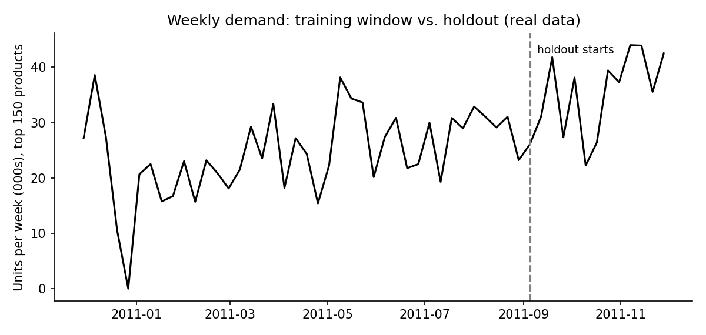
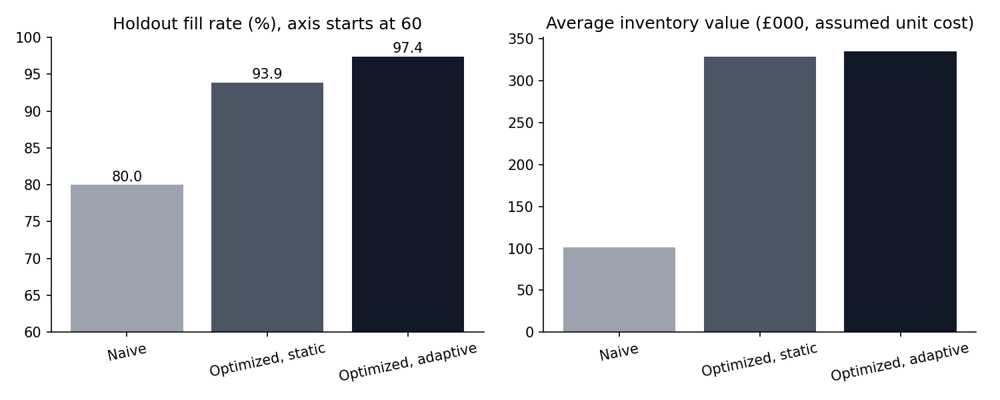

# Project 5: Inventory Policy Backtest on Real Demand (Supply Chain)

How much safety stock does a real wholesaler need, and does a statistically "optimized" policy beat a simple rule? This project estimates demand from **real transaction history**, builds ordering policies (ABC, safety stock, EOQ, reorder points), and **backtests them on a later period the policies never saw**.

**Data:** UCI *Online Retail* dataset (real UK online retailer, Dec 2010 – Dec 2011). Weekly demand for the top 150 products, built from valid sale lines with cancelled orders netted out. Source and citation: see [`common/retail.py`](../common/retail.py) and Project 1.

> **What is assumed (not in the data):** unit cost (60% of selling price), order cost (£40), holding cost (22%/yr), supplier lead time (2 weeks), and stockout penalty (50% of unit cost per unit short). The dataset has sales quantities and prices only. A sensitivity table below tests the stockout assumption.

**Skills shown:** demand analysis, ABC/XYZ classification, safety stock and EOQ math, (s, S) policy simulation, train/holdout backtesting, cost trade-offs, sensitivity analysis.

## Design
- **Training window:** first 40 weeks. **Holdout:** next 13 weeks (to early Dec 2011), which includes the **holiday peak**.
- **Three policies** (weekly review, lost sales when out of stock):
  1. **Naive:** reorder when stock hits lead-time demand, no safety stock; order up to 4 weeks of demand.
  2. **Optimized, static:** safety stock = z × σ × √(L+1) with service targets by ABC class (A 98%, B 95%, C 90%); reorder quantity from EOQ. Parameters are estimated once from the training window.
  3. **Optimized, adaptive:** same formulas, but μ and σ are re-estimated every week from the latest 12 weeks.

## Results (details in [`output/results.md`](output/results.md))
| Metric (holdout) | Naive | Optimized, static | Optimized, adaptive |
|---|---|---|---|
| Fill rate | 80.0% | 93.9% | **97.4%** |
| Avg inventory value | £101,519 | £328,627 | £334,911 |
| Total cost (assumed) | £95,985 | £47,072 | **£37,926** |




## What I learned
1. **Real demand shifted.** Average weekly units were **1.4x higher** in the holdout than in training, and 66% of products sold faster. A policy trained once on the past is working with stale numbers. The **adaptive** policy handled this better (97.4% fill rate vs. 93.9% for the static one) at only slightly higher inventory.
2. **Better service costs a lot of inventory.** Both optimized policies hold about **3x** the inventory value of the naive rule. Wholesale demand is lumpy (a few big orders), so safety stock based on a normal-distribution assumption runs high. A better next step would be a demand model that fits lumpy demand directly.
3. **The cost result depends on one assumption.** If a stockout costs nothing, the naive policy is cheapest. By the time a lost unit costs **10% of its unit cost**, the adaptive policy is cheapest (the break-even point is somewhere between 0% and 10%; full table in `results.md`). In practice, you'd measure the real cost of a stockout (lost margin, expediting, customer churn) before choosing service levels.
4. **Class B was the weak spot for the static policy** (79% fill rate vs. 91% adaptive), a reminder to review every class and not just the top items.

## Limitations
- Costs and lead time are assumptions; lead time is fixed and the same for all products.
- The 150 products are the top sellers by revenue, so "ABC" here is within a group of already-important items.
- One holdout period, which includes an unusual peak. A stronger study would use rolling-origin backtests.
- Cancellation matching is exact-only; partial returns are not netted.
- Lost sales (not backorders) are assumed.

## Run it (optional, results are already saved)
```bash
pip install -r ../requirements.txt
python inventory_backtest.py
```
