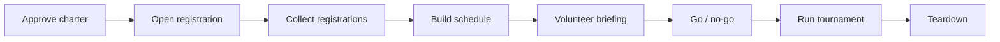

# Project 6: Project Management Plan for a Youth Basketball Tournament

A full project plan for a **hypothetical** 12-team youth basketball tournament: charter, scope, work breakdown, **critical path schedule**, risk register, budget, RACI, communications plan, and a sample status report.

> **Note:** This is a planning exercise. The dates, durations, costs, and team counts are **illustrative assumptions**, not a real event. The schedule, risk scoring, and budget are generated by `build_plan.py` so the numbers stay consistent. You don't need to run it. The results are in [`output/`](output).

**Skills shown:** project charter, scope management, WBS, critical path method (CPM), risk management, budgeting, stakeholder communication, RACI.

---

## 1. Project charter
| | |
|---|---|
| **Project** | 2-day, 12-team youth basketball tournament |
| **Objective** | Run a safe, well-organized tournament that breaks even or better |
| **Success criteria** | 12 teams registered; all games played on schedule; zero unresolved safety incidents; budget net ≥ $0; parent satisfaction ≥ 4/5 in a post-event survey |
| **Scope (in)** | Venue, registration, scheduling, referees, volunteers, insurance, awards, communications, teardown |
| **Scope (out)** | Year-round league operations, travel and accommodation for teams |
| **Assumptions** | Gym available on a suitable date; 12 teams is achievable; volunteers are unpaid |
| **Constraints** | Fixed budget; one event date; volunteer availability |
| **Stakeholders** | Organizer, volunteers, parents, players, coaches, venue, referees |

## 2. Work breakdown structure (WBS)
1. **Initiation:** charter and budget approval
2. **Venue and logistics:** book gym, insurance and first aid, setup plan
3. **Participants:** open registration, collect fees, build schedule and brackets
4. **People:** recruit and brief referees and volunteers
5. **Marketing and comms:** promotion, parent updates
6. **Awards and supplies:** trophies, shirts
7. **Execution:** go/no-go check, run tournament
8. **Closing:** teardown, payments, debrief

## 3. Schedule and critical path
Full table and Gantt chart: [`output/schedule.md`](output/schedule.md)

- Project length: **40 working days**.
- **Critical path:** approve charter → open registration → collect registrations (21 days) → build schedule → volunteer briefing → go/no-go → tournament → closing.
- **Insight:** the longest stretch, *collecting registrations*, is on the critical path. Registration speed matters more than anything else, so the plan puts early-bird pricing and outreach up front. Booking the gym has 7 days of slack in this model, but a late booking would still be a major risk (R1).

## 4. Risk register
Top risks, scored by likelihood × impact: [`output/risk_register.md`](output/risk_register.md). **Injury during games** scores highest (15), followed by low registration, volunteer shortages, and game-day schedule delays (12 each). The plan responds with a safety lead, a first-aid attendant, extra volunteer recruitment, and a dedicated schedule manager.

## 5. Budget
Details: [`output/budget.md`](output/budget.md). With 12 teams at $350 plus assumed concession income, the net is only about **$18**. Break-even on registration fees alone needs **15 teams**. The key learning is that the event is financially fragile at 12 teams, so either the fee, the cost base, or sponsorship has to improve. That's something a real organizer would want to know *before* committing.

## 6. RACI
| Activity | Organizer | Volunteer lead | Safety lead | Comms lead | Parents |
|---|---|---|---|---|---|
| Approve budget and charter | A/R | I | I | I | – |
| Book venue and insurance | A | – | R | – | – |
| Registration and fees | A | R | – | R | I |
| Recruit and brief volunteers | A | R | C | – | – |
| Safety plan and first aid | A | C | R | – | I |
| Parent communications | A | – | – | R | I |
| Game-day operations | A | R | R | C | I |

## 7. Communications plan
| Audience | What | When | Channel |
|---|---|---|---|
| Coaches / parents | Registration open, fees, rules | Week 1, then reminders | Email + one info page |
| Registered teams | Schedule and brackets | As soon as finalized, then 1 week and 1 day before | Email + text |
| Volunteers | Roles, shifts, briefing | 2 weeks and 3 days before | Group chat + briefing |
| Venue | Setup needs, timings | 2 weeks and 2 days before | Email |

## 8. Sample status report (illustrative, "Week 4")
- **Overall:** Amber
- **Done:** charter approved; gym confirmed; registration opened; insurance quote received
- **In progress:** 7 of 12 teams registered (target by this week: 8); referee recruitment 60% complete
- **Risks / issues:** R2 (low registration) is trending up; mitigation: early-bird extended once, direct outreach to last year's teams
- **Decisions needed:** approve a $100 marketing spend
- **Next 2 weeks:** close registration, publish bracket, volunteer briefing booked

## Limitations
No resource leveling, only one calendar (no holidays), and fixed task durations. A more advanced version would use three-point estimates (optimistic / likely / pessimistic) and a Monte Carlo simulation of the schedule.
