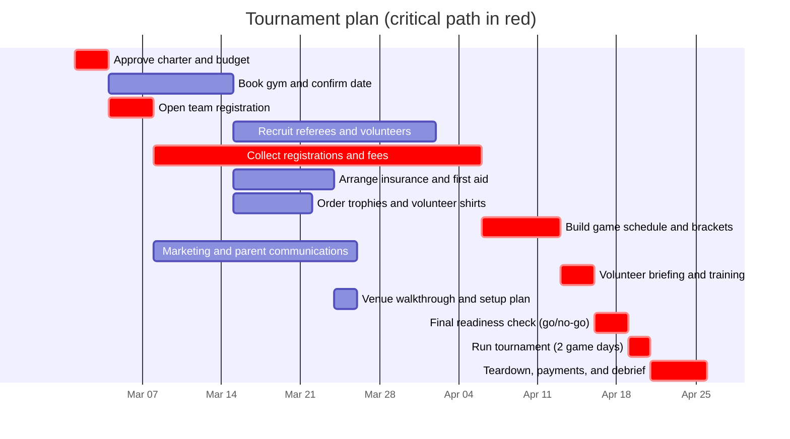

# Schedule and critical path (auto-generated)

Kickoff: **2027-03-01** (assumed). Project length: **40 working days**, finishing **2027-04-26**.

**Critical path:** A (Approve charter and budget) → C (Open team registration) → E (Collect registrations and fees) → H (Build game schedule and brackets) → J (Volunteer briefing and training) → L (Final readiness check (go/no-go)) → M (Run tournament (2 game days)) → N (Teardown, payments, and debrief)

Any delay on a critical task delays the tournament day by the same amount. Non-critical tasks have slack shown below.

| ID | Task | Days | Depends on | Start | Finish | Slack (days) | Critical |
|---|---|---|---|---|---|---|---|
| A | Approve charter and budget | 3 | - | 2027-03-01 | 2027-03-04 | 0 | **Yes** |
| B | Book gym and confirm date | 7 | A | 2027-03-04 | 2027-03-15 | 7 |  |
| C | Open team registration | 2 | A | 2027-03-04 | 2027-03-08 | 0 | **Yes** |
| D | Recruit referees and volunteers | 14 | B | 2027-03-15 | 2027-04-02 | 7 |  |
| E | Collect registrations and fees | 21 | C | 2027-03-08 | 2027-04-06 | 0 | **Yes** |
| F | Arrange insurance and first aid | 7 | B | 2027-03-15 | 2027-03-24 | 15 |  |
| G | Order trophies and volunteer shirts | 5 | B | 2027-03-15 | 2027-03-22 | 17 |  |
| H | Build game schedule and brackets | 5 | E | 2027-04-06 | 2027-04-13 | 0 | **Yes** |
| I | Marketing and parent communications | 14 | C | 2027-03-08 | 2027-03-26 | 15 |  |
| J | Volunteer briefing and training | 3 | D, H | 2027-04-13 | 2027-04-16 | 0 | **Yes** |
| K | Venue walkthrough and setup plan | 2 | F, G | 2027-03-24 | 2027-03-26 | 15 |  |
| L | Final readiness check (go/no-go) | 1 | J, K, I | 2027-04-16 | 2027-04-19 | 0 | **Yes** |
| M | Run tournament (2 game days) | 2 | L | 2027-04-19 | 2027-04-21 | 0 | **Yes** |
| N | Teardown, payments, and debrief | 3 | M | 2027-04-21 | 2027-04-26 | 0 | **Yes** |

